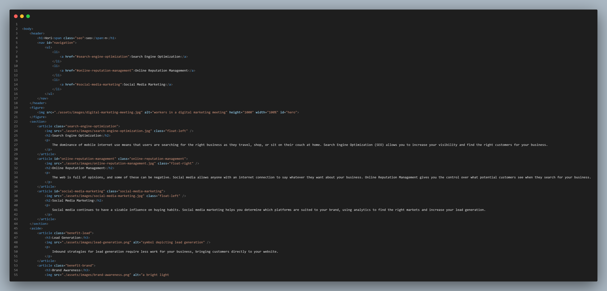

# Challenge-Horiseon-wk1

## Description
This project focuses on an essential aspect of web development, ‘accessibility’. As part of the requirement, I was hired by a marketing agency to refactor an existing site to make it more accessible. The scope of the project and its deliverables have been documented below.

* Semantic HTML elements can be found throughout the source code
* HTML elements follow a logical structure independent of styling and positioning
* Image and icon elements contain accessible `alt` attributes
* Heading attributes fall in sequential order
* Title elements contain a concise, descriptive title

## Installation

Not applicable

## Usage

The webpage has been resrtuctured using the following semantic layout

You can review the layout of the webape via Devtools using Command+Option+I (macOS) or Control+Shift+I (Windows). Alternatively, I have attached a shot of the code for faster viewing.

## Credits

Not applicable

## License

Please refer to the LICENSE in the repo.

   